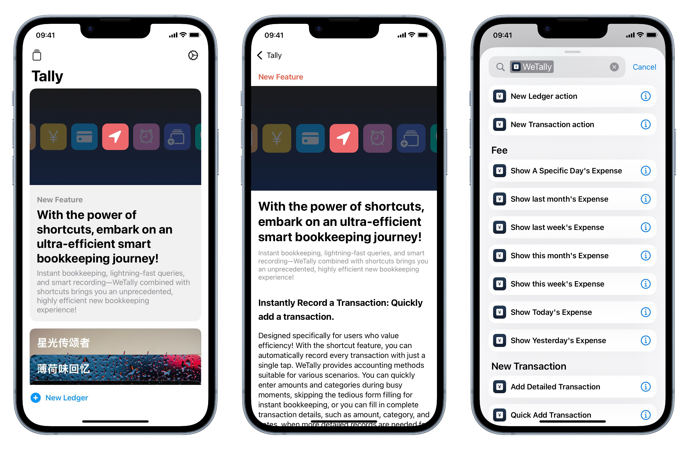

#  Boost Your Budgeting Efficiency with Shortcuts – A Smarter Way to Track Your Finances!

With WeTally and Shortcuts, managing your finances has never been this fast and efficient! Quick transaction logging, rapid expense tracking, and smart automation are all just a tap away!

## Instant Transaction Logging: Track Expenses in Seconds

Tailored for efficiency-seekers, WeTally integrates seamlessly with Shortcuts, allowing you to log transactions instantly. Whether you're adding a quick expense on-the-go or recording detailed data like amounts, categories, and notes, we’ve got you covered. Forget about manually filling out forms; with just a tap, your transaction is recorded, saving you time for smarter financial decisions.

## Real-Time Spending Insights: Instant Expense Overview (Siri Voice Support Included)

Stay on top of your finances effortlessly. With Shortcuts, you can instantly check your expenses for today, yesterday, or this week—giving you a quick snapshot of where your money is going. Even better, you can use Siri to quickly retrieve your spending summary. Just say, “Hey Siri, show me today’s expenses,” and Siri will instantly present the details. Managing your finances has never been more convenient and smart!

## Smart, Automated Transactions: Tailor Your Budgeting Experience

WeTally takes automation to the next level with intelligent triggers, making your budgeting experience smarter and more personalized.

### Schedule Transactions
Set automatic transactions to log at specific times—like a recurring rent payment on the 1st of each month or your daily coffee expense. WeTally will take care of it automatically, so you never miss a record.

### Location-Based Triggers
Worried about forgetting to log a transaction after a trip to the gym or the store? With location-based triggers, WeTally can automatically record transactions when you arrive at specific locations. Whether it’s your gym membership or daily breakfast, we’ve got it covered!

### One-Tap Common Expenses: Add Your Frequent Transactions Instantly
For your most frequent expenses, you can preset shortcuts to log them with just a tap. No more entering repetitive details—your regular expenses are recorded instantly!

## More Surprises Await!

Unlock even more intelligent features by integrating Shortcuts with WeTally. Experience a faster, smarter way to manage your finances, and take control of your money like never before!
